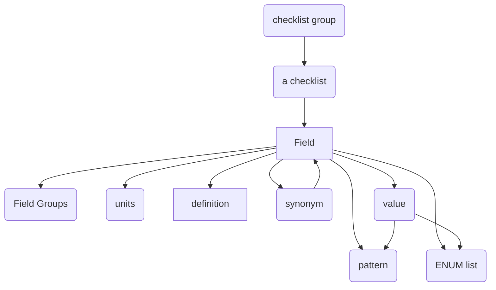

```mermaid
  graph TD;
      A(checklist group)-->B(a checklist);
      B-->Field
      Field-->D(Field Groups);
     Field-->U(units);
     Field-->definition;
     Field-->P(pattern);
     Field-->E(ENUM list);
     Field-->S(synonym)
     S-->Field
     Field-->V(value);
     V-->P;
     V-->E;
```