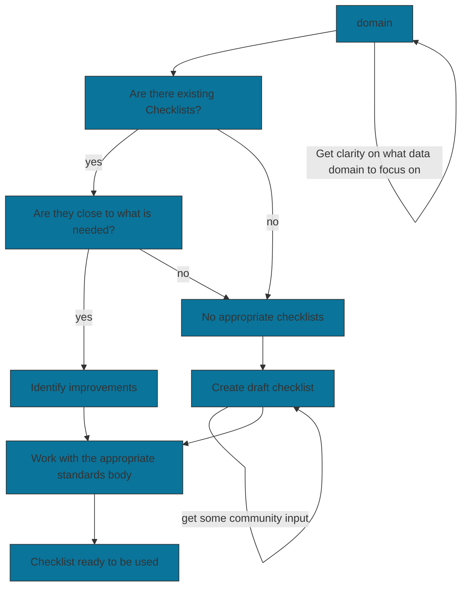
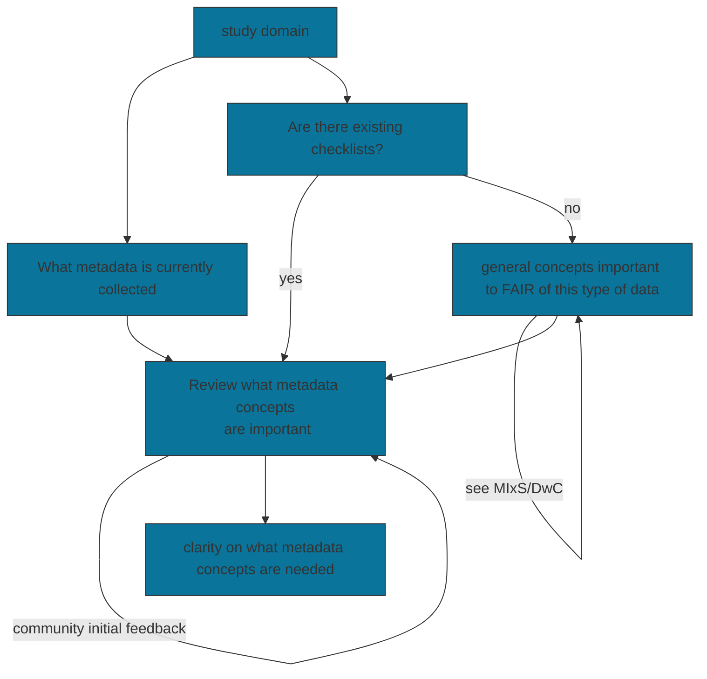
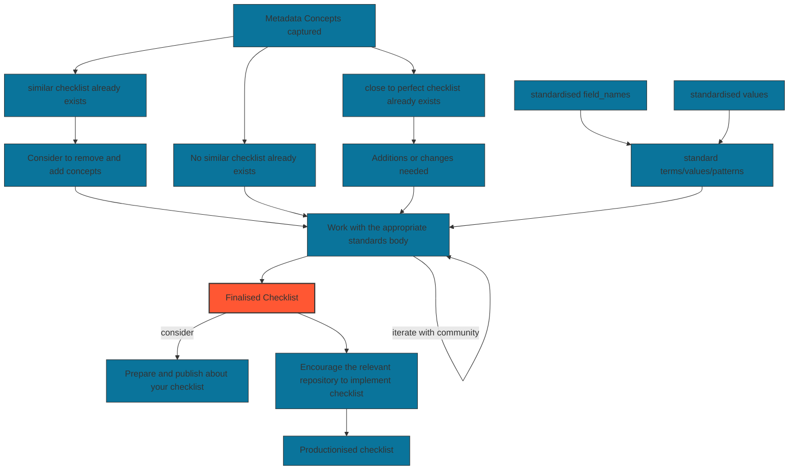
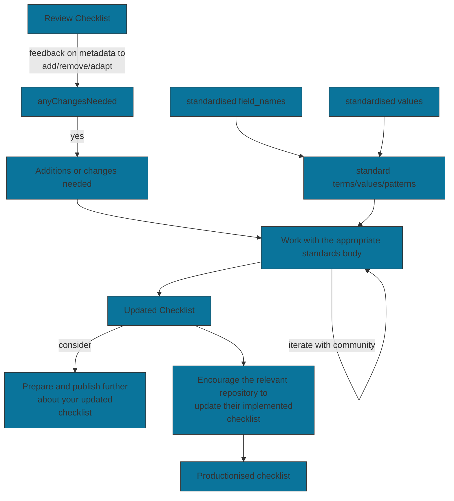

# Creating Biological Metadata Checklists and Making them Standards

+++
<br/>


````{panels_fairplus}
:identifier_text: RX.X
:identifier_link: 
:difficulty_level: 2
:recipe_type: Guidance
:reading_time_minutes: 15
:intended_audience: data_manager, Terminology Manager, Data Curator
:has_executable_code: nope
:recipe_name: Recipe Template
```` 


## Main Objectives

The main purpose of this recipe is:

> To guide how to create a biological metadata checklist and make it a standard. With the obvious _priviso_ that 
> it is usually better to be able to reuse and improve an existing one.

---


## Graphical Overview





---


## Requirements

* technical requirements:
   * Excel skills

* knowledge requirement:
   * Know your biological domain and what typical metadata scientists collect.
   * Also know what metadata scientists in your domain like to query and or view.
   * Understand in general about standards bodies such as GSC (for MIxS), TDWG (for DwC), etc.


---

## Capability & Maturity Table


| Capability                       | Initial Maturity Level | Final Maturity Level |
|:---------------------------------|:-----------------------|:---------------------|
| Findability and Interoperability | minimal                | repeatable           |


---

## FAIRification Objectives, Inputs and Outputs

```{admonition} Important
:class: tip
this section is relied upon by another component developed by FAIRplus to enhance search and presentation. It is therefore important to comply with the layout. 
```

| Actions.Objectives.Tasks                                  | Input                                                                   | Output                                               |
|:----------------------------------------------------------|:------------------------------------------------------------------------|:-----------------------------------------------------|


## Table of Data Standards

```{admonition} Important
:class: tip
this section is relied upon by another component developed by FAIRplus to enhance search and presentation. It is therefore important to comply with the layout. 
```

Authors should list all the data standards, format specification, syntax and controlled terminologies used in the FAIRification process applied to the IMI project data.
Ideally, authors should mark up the information using either EDAM Ontology URI or FAIRsharing identifiers (which are DOIs)

| Data Formats | Terminologies                                                                    | Models |
|:-------------|:---------------------------------------------------------------------------------|:-------|
| GSC MIxS     | https://www.gensc.org//pages/projects/mixs-gsc-project.html                      |        |
| TDWG DwC     | https://www.tdwg.org/standards/dwc/                                              |        |
---


## Main Content

### Introduction
Much of science involves collecting samples, processing them
and then measuring different aspects of them. Most of the principles and even in data flow
will apply generically, but here we want to focus on samples of biological material.

Checklists of controlled field_names and values are part of good data management. 
Done well, they intuitively guide the data generators on what field_names are mandatory, 
highly recommended or optional for the biological domain of study.  
Importantly, checklists also help findability and reusability of the data, i.e. applying some of the FAIR principles.

### In
- Knowledge of what metadata you or your project team are currently collecting.
- Knowledge of what questions you would like to ask of the (meta)data. 


### Considerations
- Using established standards such as [GSC MIxS](https://www.gensc.org//pages/projects/mixs-gsc-project.html) 
or [TDWG DwC](https://www.tdwg.org/standards/dwc/) increases interoperability.
- By reusing existing checklists, the whole scientific community benefits, and also it will save time in reinvention.
- Even if a new checklist is needed, it is good practice to use the standardised field names that map to your
desired metadata concepts.

### Find out what metadata is important to your study domain
There is much common metadata like *project name*, *collection date*, *country* and *sample name* that will
apply to most study's sample metadata. However, different areas of biology and the environment, e.g., collecting 
eDNA from a stream, taking a tissue sample of a whale, collecting insects in a field, or the microbiome 
of laboratory animals will have many additional relevant pieces of metadata. Sometimes it can be complex, and it 
can help to engage your wider community.

- An important first step is to determine what metadata is important for your domain of study.
- Are there already checklists for your or very similar domains?
- Can you get input from your collaborators and rivals?

*Figure: Finding out what metadata is important to your study domain*


There are many alternatives to the above, for example, some teams go straight to their community and 
request them to all contribute to generate a list of important metadata concepts. Nevertheless, the important principle of this
is to make use of several different sources and to get some community involvement.


### Going from metadata concepts to a productionised checklist
In the previous steps, we have at least collected metadata concepts. Now we need to transform these concepts
to field_names and controlled vocabularies (ontologies are even better) or allowed patterns for the values. 
Also, we need to then get it adopted by the community and ideally be a sustainable state.

*Figure: Going from metadata concepts to a productionised checklist*


### Regularly review and improve the checklist
Every few years, particularly if there has been a paradigm shift in your domain, consider reviewing
and updating the checklist. 

**Figure: Reviewing and improve the checklist regularly**

There are many advantages of working with standards bodies. Working with such as GSC MIxs means that your 
checklist will automatically benefit from some improvements to terms and values as the community evolves and learns.

---

## Conclusion

- Creating a checklist takes time and dedication,
- The time to do so can be much reduced by using or adapting existing checklists,
- Use existing standards to increase the interoperability.
- Work with standards bodies, as they will help guide you and also your checklist becomes more sustainable


---

## References:

```{footbibliography}
```


---

## Authors

```{note}
List the recipe contributors following the structure below and using the CASRAI credit vocabulary and do not change the structure of the table.
    - Conceptualization - Peter Woollard
    - Data curation
    - Formal Analysis
    - Funding acquisition
    - Investigation
    - Methodology
    - Project administration

    - Resources
    - Software
    - Supervision
    - Validation
    - Visualization
    - Writing - original draft - Peter Woollard
    - Writing - review & editing - 
```

```{admonition} Important
:class: tip
this section is relied upon by another component developed by FAIRplus to enhance search and presentation. It is therefore important to comply with the layout. 
```


| Name                                                                                                                                                                                                                  | Orcid                                                                                                               | Affiliation                           | Type                                                                    |                                             Elixir Node                                             |                  Credit Role                  |
|-----------------------------------------------------------------------------------------------------------------------------------------------------------------------------------------------------------------------|---------------------------------------------------------------------------------------------------------------------|---------------------------------------|-------------------------------------------------------------------------|:---------------------------------------------------------------------------------------------------:|:---------------------------------------------:|
| <div class="firstCol"><a target="_blank" href='https://github.com/'></img><div class="d-block">Peter Woollard</div></a>  </div> | <a target="_blank" href='https://orcid.org/0000-0002-7654-6902'><i class='fab fa-orcid fa-2x text--orange'></i></a> | European Nucleotide Archive, EMBL-EBI | <i class="fas fa-graduation-cap fa-1x text--orange" alt="Academic"></i> | </img> | Writing - Review & Editing, Conceptualization |

---

## License

````{license_fairplus}
CC-BY-4.0
````
