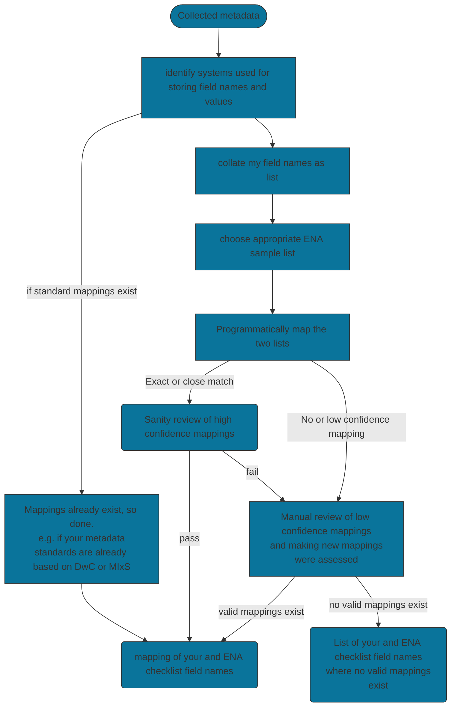
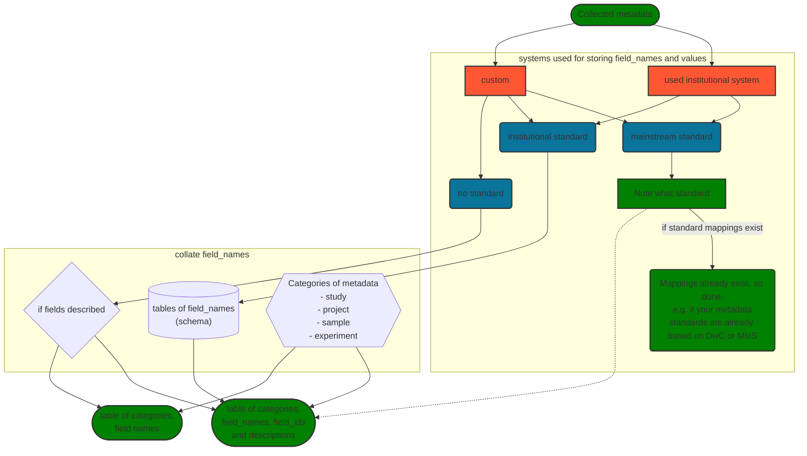
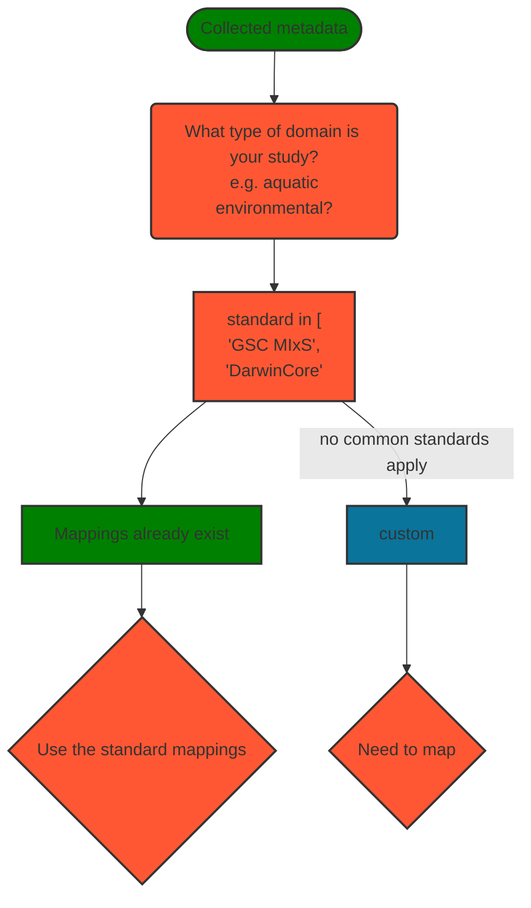
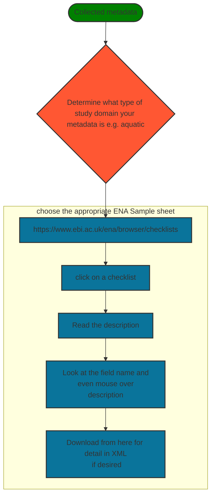
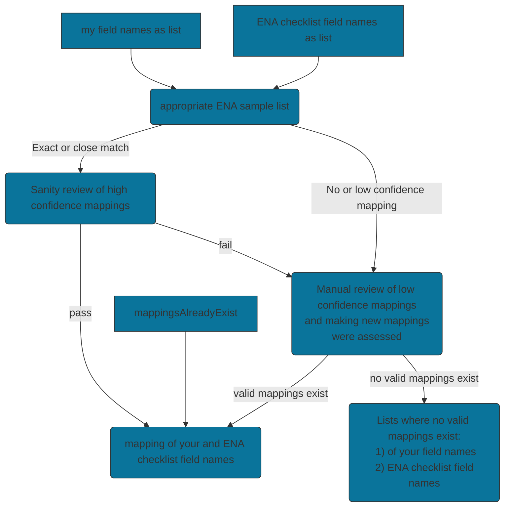
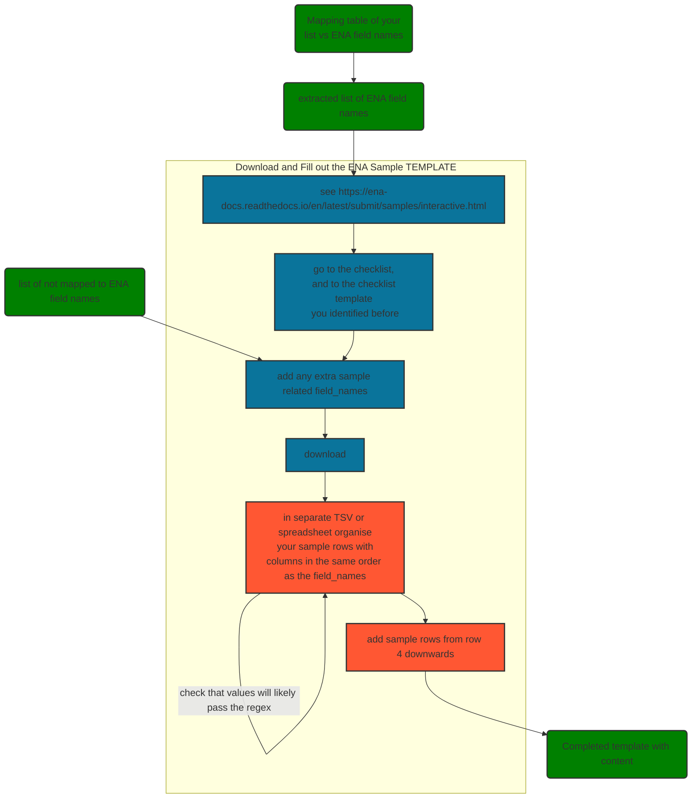

# Mapping In-house Metadata to ENA's Checklists

+++
<br/>


````{panels_fairplus}
:identifier_text: RX.X
:identifier_link: 
:difficulty_level: 2
:recipe_type: Guidance
:reading_time_minutes: 15
:intended_audience: data_manager, Terminology Manager, Data Curator
:has_executable_code: nope
:recipe_name: Recipe Template
````

## Main Objectives

The main purpose of this recipe is:

> To guide how to map in-house metadata to ENA's sample checklists and other input objects.
> This is quite simplistic in that it is mainly just using the field names.

---


## Graphical Overview

```{note} 
use this section to provide a decision tree for the overall process described in the recipe
For more information about the syntax used to generate the diagram, please refer to the [following documentation](https://mermaid-js.github.io/mermaid/#/flowchart)
```

```{figure_fairplus} ./images/C-3PO_droid.png
name: fcb-help-recipe-template-figure1
subtitle: C-3PO_droid
```

### Figure: Overview of discovering what metadata you are using(if any), map and analysis, to get a mapping

---


## Requirements

* technical requirements:
   * Excel skills
   * possibly basis scripting to compare terms

* knowledge requirement:
   * know what your source metadata schema is.
   * understand what you are trying to achieve and why this helps 
   * [understand in general about GSC and MIxS](https://www.gensc.org//pages/projects/mixs-gsc-project.html)
   * [understand the ENA metadata model]( https://ena-docs.readthedocs.io/en/latest/submit/general-guide/metadata.html) 

---

## Capability & Maturity Table

This section is meant for authors to describe the specific `capability` which they aim to bring from one `maturity level` to the next.
This is therefore to document the methods used **to enable change** at the level of information process
The table is therefore structure to identify the capability, the **initial** maturity level it is estimated to be and the **final** maturity it has been brought to.


| Capability       | Initial Maturity Level | Final Maturity Level |
|:-----------------|:-----------------------|:---------------------|
| Interoperability | minimal                | repeatable           |


---

## FAIRification Objectives, Inputs and Outputs

```{admonition} Important
:class: tip
this section is relied upon by another component developed by FAIRplus to enhance search and presentation. It is therefore important to comply with the layout. 
```

| Actions.Objectives.Tasks                                  | Input                                                                   | Output                                               |
|:----------------------------------------------------------|:------------------------------------------------------------------------|:-----------------------------------------------------|


## Table of Data Standards

```{admonition} Important
:class: tip
this section is relied upon by another component developed by FAIRplus to enhance search and presentation. It is therefore important to comply with the layout. 
```

Authors should list all the data standards, format specification, syntax and controlled terminologies used in the FAIRification process applied to the IMI project data.
Ideally, authors should mark up the information using either EDAM Ontology URI or FAIRsharing identifiers (which are DOIs)

| Data Formats                                        | Terminologies                                                          | Models                                                |
|:----------------------------------------------------|:-----------------------------------------------------------------------|:------------------------------------------------------|
---

## Main Content

### Introduction
The European Nucleotide Archive (ENA) is one of the INSDC members where much of the world's nucleotide data is submitted to and archived. 
Sample related metadata submitted via checklist templates. 
The field names on the templates are usually based on [GSC MIxS](https://www.gensc.org//pages/projects/mixs-gsc-project.html) standards. 
This is particularly true of sample related metadata. Project, sequencing experiment and other metadata are collected
separately, usually with manifests.

Well-resourced scientific institutions often have their own sample and sequence data management platforms.
The metadata concepts and metadata architecture will usually be somewhat different to that of the ENA. 
The challenge and the focus of this recipe are the approaches to shape the metadata appropriately.

### In
- Knowledge of what metadata you are currently using
- An appropriate ENA checklist

### Find out what metadata it is and what standards they follow


### Preparing to Align your Metadata with ENA's

In preparation for aligning your metadata your need to investigate your metadata:
- what type of ENA checklist is closest to your type of study?
- what metadata standards currently apply to your metadata? 

Links
- see checklists in https://www.ebi.ac.uk/ena/browser/checklists
- see https://ena-docs.readthedocs.io/en/latest/submit/samples/interactive.html



#### Choose an appropriate ENA Sample Checklist


### If needed: mapping of your field names to ENA checklist field names
Now that you have both your own field names and those of the appropriate ENA checklist, you can then 
proceed with the actual mapping. Unless you only have a small number of field names to map, it is best to utilise some 
computers. Doing exact strong matching is straight forwards.  Many field names differ by something simple like upper or lower case, spaces, dialect 
spelling (American/British English), plurals, etc. Fortunately, "fuzzy string matching" will cope with these simple differences.

- Programmatically, as simple way of doing this is using a fuzzy string matcher library in python such as
https://github.com/rapidfuzz/RapidFuzz and similar exist in R.
- Excel now allows fuzzy string matching too (https://www.microsoft.com/en-gb/download/details.aspx?id=15011).
- For the more techie familiar with Linkml, there is an even better resource for doing the mappings: https://github.com/cidgoh/DataHarmonizer 
This takes into account more of the other information of the field name that just the string content of it, but using 
associated properties.

Whatever way you choose the recipe will be very similar. You will always have to do at least do some manual checking. 
Often you will also have to decide whether two field_names are close enough, it is worth reading the definitions/descriptions
to help with this. Sometimes the granularities being captured are different, or there are two field names in your 
metadata and just one in ENA. These can be difficult to decide to map these.

You will end up with a file of pairwise matches of field_names that are equivalent in an ENA checklist and in your 
own metadata. You will often have a list of field names from your own metadata and in ENA that do not match. It is sensible
to prioritise unmapped ENA field_names which are mandatory or recommended, for trying to find conceptually similar terms to map to. 




### Once you have your mappings create a Sample Template
Once you have your mappings create a Sample Template and then fill this out

Tip: For any programmers/scripters out there, once you know what the template is you could automate:
- from the template you know the format
- from the mapping file you know which file_names in your metadata correspond to which in the ENA.
- then going forwards you can have a script to automated converting your instutions metadata to a format 
suitable to submit to ENA. 




---

## Next Steps
In the case of ENA, there is further metadata to add to other objects, other than sample level. There are 
relatively few metadata fields on each of these, so you may be quicker mapping this manually.
- project/study level e.g. project/study name
- sequencing experiment  e.g. for sequencing instrument and platform


## Conclusion
- Mapping In-house Metadata to other checklists or standards is important.
- For a handful of terms, manual mapping is the quickest.
- When over twenty or so terms, semi-automation is wise as it saves time and 
also means that you are less likely to miss obvious things.
- Some manual checking is essential and almost always needed.
- Once you have the mapping it allows you to automate submission, saving time and reducing errors.

---

## References:

```{footbibliography}
```


---

## Authors

```{note}
List the recipe contributors following the structure below and using the CASRAI credit vocabulary and do not change the structure of the table.
    - Conceptualization - Peter Woollard
    - Data curation
    - Formal Analysis
    - Funding acquisition
    - Investigation
    - Methodology
    - Project administration

    - Resources
    - Software
    - Supervision
    - Validation
    - Visualization
    - Writing - original draft - Peter Woollard
    - Writing - review & editing - Peter Woollard
```

```{admonition} Important
:class: tip
this section is relied upon by another component developed by FAIRplus to enhance search and presentation. It is therefore important to comply with the layout. 
```


| Name                                                                                                                                                                                                                  | Orcid                                                                                                               | Affiliation                           | Type                                                                    |                                             Elixir Node                                             |                  Credit Role                  |
|-----------------------------------------------------------------------------------------------------------------------------------------------------------------------------------------------------------------------|---------------------------------------------------------------------------------------------------------------------|---------------------------------------|-------------------------------------------------------------------------|:---------------------------------------------------------------------------------------------------:|:---------------------------------------------:|
| <div class="firstCol"><a target="_blank" href='https://github.com/'></img><div class="d-block">Peter Woollard</div></a>  </div> | <a target="_blank" href='https://orcid.org/0000-0002-7654-6902'><i class='fab fa-orcid fa-2x text--orange'></i></a> | European Nucleotide Archive, EMBL-EBI | <i class="fas fa-graduation-cap fa-1x text--orange" alt="Academic"></i> | </img> | Writing - Review & Editing, Conceptualization |

---

## License

````{license_fairplus}
CC-BY-4.0
````
