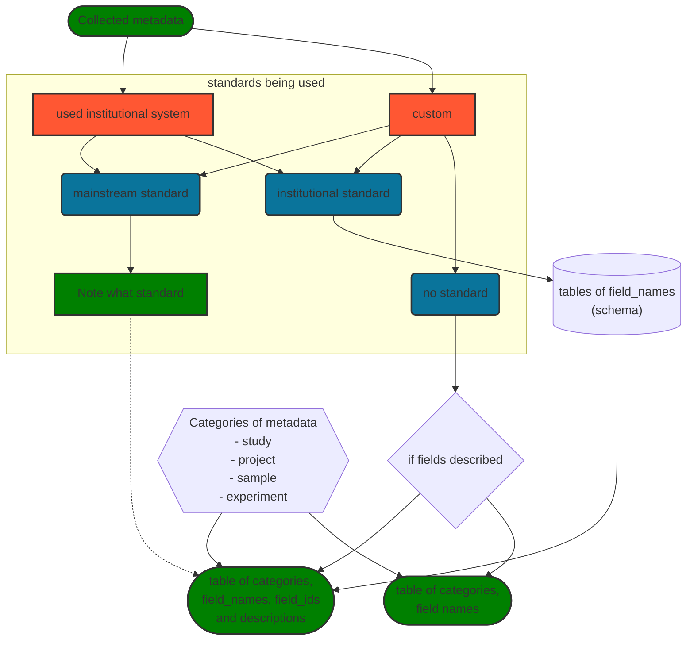

# Mapping In-house Metadata to ENA's Checklists

+++
<br/>


````{panels_fairplus}
:identifier_text: RX.X
:identifier_link: 
:difficulty_level: 2
:recipe_type: Guidance
:reading_time_minutes: 15
:intended_audience: data_manager, Terminology Manager, Data Curator
:has_executable_code: nope
:recipe_name: Recipe Template
```` 


## Main Objectives

The main purpose of this recipe is:

> To guide how to map in-house metadata to ENA's sample checklists and other input objects

---


## Graphical Overview

```{note} 
use this section to provide a decision tree for the overall process described in the recipe
For more information about the syntax used to generate the diagram, please refer to the [following documentation](https://mermaid-js.github.io/mermaid/#/flowchart)
```

```{figure_fairplus} ./images/C-3PO_droid.png
name: fcb-help-recipe-template-figure1
subtitle: C-3PO_droid
```


---


## Requirements

* technical requirements:
   * Excel skills
   * possibly basis scripting to compare terms

* knowledge requirement:
   * know what your source metadata schema is.
   * understand what you are trying to achieve and why, this helps 
   * [understand in general about GSC and MIxS](https://www.gensc.org//pages/projects/mixs-gsc-project.html)
   * [understand the ENA metadata model]( https://ena-docs.readthedocs.io/en/latest/submit/general-guide/metadata.html) 

---

## Capability & Maturity Table

This section is meant for authors to describe the specific `capability` which they aim to bring from one `maturity level` to the next.
This is therefore to document the methods used **to enable change** at the level of information process
The table is therefore structure to identify the capability, the **initial** maturity level it is estimated to be and the **final** maturity it has been brought to.


| Capability       | Initial Maturity Level | Final Maturity Level |
|:-----------------|:-----------------------|:---------------------|
| Interoperability | minimal                | repeatable           |


---

## FAIRification Objectives, Inputs and Outputs

```{admonition} Important
:class: tip
this section is relied upon by another component developed by FAIRplus to enhance search and presentation. It is therefore important to comply with the layout. 
```

| Actions.Objectives.Tasks                                  | Input                                                                   | Output                                               |
|:----------------------------------------------------------|:------------------------------------------------------------------------|:-----------------------------------------------------|


## Table of Data Standards

```{admonition} Important
:class: tip
this section is relied upon by another component developed by FAIRplus to enhance search and presentation. It is therefore important to comply with the layout. 
```

Authors should list all the data standards, format specification, syntax and controlled terminologies used in the FAIRification process applied to the IMI project data.
Ideally, authors should mark up the information using either EDAM Ontology URI or FAIRsharing identifiers (which are DOIs)

| Data Formats                                        | Terminologies                                                          | Models                                                |
|:----------------------------------------------------|:-----------------------------------------------------------------------|:------------------------------------------------------|
---

## Main Content

### Introduction
The European Nucleotide Archive(ENA) is one of the INSDC members where much of the worlds nucleotide data is submitted to and archived. 
Sample related metadata submitted via checklist templates. 
The field names on the templates are usually based on [GSC MIxS](https://www.gensc.org//pages/projects/mixs-gsc-project.html) standards. 
This is particularly true of sample related metadata. Project, sequencing experiment and other metadata is collected separately usually with manifests.

Well resourced scientific institutions often have their own sample and sequence data management platforms.
The metadata concepts and metadata architecture will usually be somewhat different to that of the ENA. 
The challenge and the focus of this recipe are the approaches to shape the metadata appropriately.

### In


### ... write executable code


### ...insert bibliographic references

````{admonition} Tip
:class: tip

If you need to include bibliographic reference, use the following syntax: 

```md
{footcite}`Gu2020`
```

````

This style of referencing will show up in text like this {footcite}`Gu2020`, and clicking on the link will take you to the `Reference`section at the bottom of the page.


### ... create workflow figures

If you want to include figures, please use the following 


<!-- 
```{figure_fairplus} ./my_figure.svg
name: fcb-help-recipe-template-figure1
subtitle: the proper caption for the figure.
```
-->


one may use the following **[mermaid](https://mermaid-js.github.io/mermaid/#/)** syntax:

````{panels} 
:container: container-lg pb-3
:column: col-lg-12 p-2
:card: rounded

<div class="mermaid">
graph TD;
    A[input data]-->B[conversion to open format]
    A[input data]-->C[automatic annotation]
    B[conversion to open format]-->D((output data))
    C[automatic annotation]-->D((output data))  
    style A fill:#FF5733,stroke:#333,stroke-width:2px
    style D fill:#0A749B,stroke:#333,stroke-width:2px
</div>
````
### Find out what metadata it is and what standards they follow

---

## Conclusion

> Summarize Key Learnings of the recipe.
> 
> Suggest further reading using the following:
> ### What should I read next?
> * 


---

## References:

```{footbibliography}
```


---

## Authors

```{note}
List the recipe contributors following the structure below and using the CASRAI credit vocabulary and do not change the structure of the table.
    - Conceptualization - Peter Woollard
    - Data curation
    - Formal Analysis
    - Funding acquisition
    - Investigation
    - Methodology
    - Project administration

    - Resources
    - Software
    - Supervision
    - Validation
    - Visualization
    - Writing - original draft - Peter Woollard
    - Writing - review & editing - Peter Woollard
```

```{admonition} Important
:class: tip
this section is relied upon by another component developed by FAIRplus to enhance search and presentation. It is therefore important to comply with the layout. 
```


| Name                                                                                                                                                                                                                  | Orcid                                                                                                               | Affiliation                           | Type                                                                    |                                             Elixir Node                                             |                  Credit Role                  |
|-----------------------------------------------------------------------------------------------------------------------------------------------------------------------------------------------------------------------|---------------------------------------------------------------------------------------------------------------------|---------------------------------------|-------------------------------------------------------------------------|:---------------------------------------------------------------------------------------------------:|:---------------------------------------------:|
| <div class="firstCol"><a target="_blank" href='https://github.com/'></img><div class="d-block">Peter Woollard</div></a>  </div> | <a target="_blank" href='https://orcid.org/0000-0002-7654-6902'><i class='fab fa-orcid fa-2x text--orange'></i></a> | European Nucleotide Archive, EMBL-EBI | <i class="fas fa-graduation-cap fa-1x text--orange" alt="Academic"></i> | </img> | Writing - Review & Editing, Conceptualization |

---

## License

````{license_fairplus}
CC-BY-4.0
````
