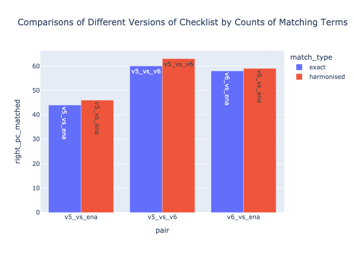

# Review of the MIX-S checklists proposed by GSC

|    | left_repo   | right_repo   | match_type   |   matches |   uniq_left |   left_pc_matched |   uniq_right |   right_pc_matched | pair      |
|---:|:------------|:-------------|:-------------|----------:|------------:|------------------:|-------------:|-------------------:|:----------|
|  0 | mixs_v5     | ena_cl       | exact        |       278 |         231 |                54 |          347 |                 44 | v5_vs_ena |
|  0 | mixs_v5     | ena_cl       | harmonised   |       290 |         219 |                56 |          331 |                 46 | v5_vs_ena |
|  0 | mixs_v5     | mixs_v6      | exact        |        53 |         456 |                10 |          742 |                  6 | v5_vs_v6  |
|  0 | mixs_v5     | mixs_v6      | harmonised   |       157 |         352 |                30 |          636 |                 19 | v5_vs_v6  |
|  0 | mixs_v6     | ena_cl       | exact        |        42 |         753 |                 5 |          583 |                  6 | v6_vs_ena |
|  0 | mixs_v6     | ena_cl       | harmonised   |       133 |         660 |                16 |          488 |                 21 | v6_vs_ena |